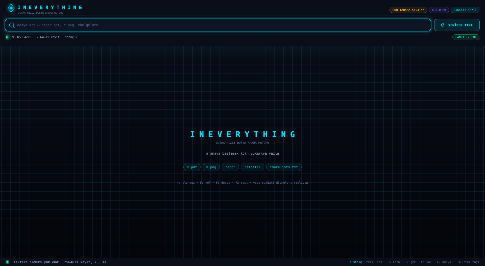

<h1 align="center">InEverything</h1>

<p align="center">An Everything-inspired, bilingual (Türkçe / English) ultra fast file search and management app for your desktop (Rust + eframe/egui).</p>

<p align="center">
  
</p>

## Features

- Persistent index: files are scanned in parallel once and written to a single `mmap`-ed file, so later launches take milliseconds
- Parallel system scan (`rayon` + work queue); scan roots and excludes come from the config, empty roots scan every volume
- Allocation-free, lock-free search: raw byte search with `memchr::memmem`, 0-3 scoring, best N results picked with `select_nth_unstable`
- Live watch (`notify`): created and deleted files show up instantly, the index refreshes itself after 20k changes
- Extension filter (`*.pdf`) and combined queries (`*.pdf report`), virtualized result list (10k rows stay smooth)
- Right-click menu plus per-row buttons: `COPY PATH` / `COPY FILE` / `MOVE` — copy the path or the file itself to the clipboard, or move the file to another folder
- Keyboard shortcuts: `Ctrl+I` focus search, `F5` rescan, `↑↓`/`Home`/`End` navigate, `F1` copy path, `F2` copy file, `F3`/`Enter` move
- 2 languages: Turkish and English — the round button in the top-right corner switches the whole interface instantly, with no restart
- Futuristic neon theme, embedded logo, Windows / macOS / Linux support
- Single-file installs: AppImage / .rpm / .exe / .app / tar.gz

## Installation

Build and run the project locally:

```bash
git clone https://github.com/colgecen/InEverything.git
cd InEverything
./ineverything
```

That builds the project, then asks which operating system and package format you want (Linux: AppImage/RPM/tar.gz/binary, Windows: .exe/.exe+zip, macOS: app/tar.gz/binary) and writes the result to `build/`. Install the helper as a command with:

```bash
./ineverything --install
```

Prebuilt binaries are on the [releases](https://github.com/colgecen/InEverything/releases) page.

## Usage

Run it with:

```bash
./target/release/ineverything
```

Start typing in the search box — results filter as you type and the first row is selected automatically. **Double-click** a row to open the file; the right-click menu offers `Open`, `Open file location`, `Copy path`, `Copy file to clipboard` and `Move…`, and the row buttons do the same without the menu.

| Shortcut | Action |
| --- | --- |
| `Ctrl+I` | Focus the search box |
| `F5` | Rescan the filesystem |
| `↑` `↓` · `Home` `End` | Navigate rows |
| `F1` · `Ctrl+1` | Copy the path to the clipboard |
| `F2` · `Ctrl+2` | Copy the file to the clipboard |
| `F3` · `Enter` · `Ctrl+3` | Move the file (destination picked in the file manager) |

The round button in the top-right corner reads `EN` while the interface is Turkish and `TR` while it is English; every label, menu, status message and unit switches in place. The choice is stored as `dil` (`"tr"` / `"en"`) in `~/.config/InEverything/config.json`, next to the index at `~/.local/share/InEverything/indeks.bin`.

## Screenshots

<p align="center">
  
</p>

## License

This project is licensed under the [MIT](LICENSE) license.